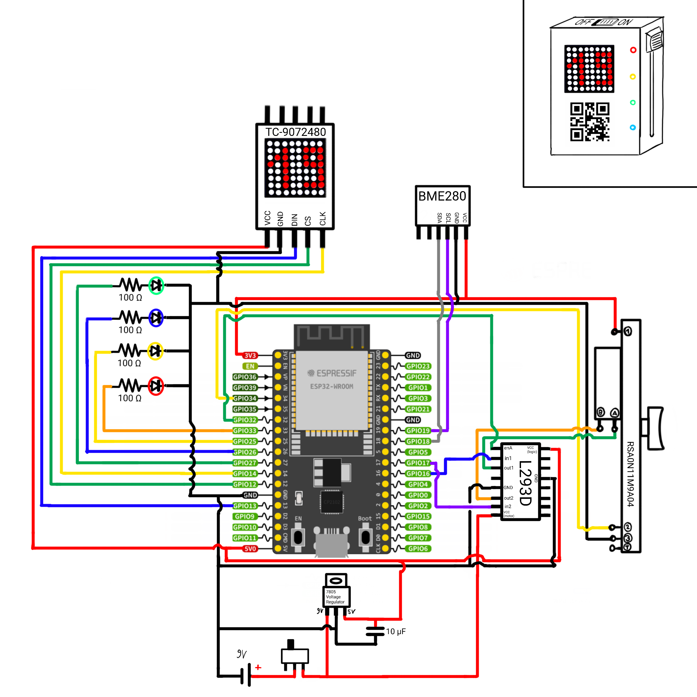

# PWP Temperature Sensor
State: 23.03.2023

In order to avoid fully overwriting the old states for archiving purposes, the final code for the temperature sensor is contained within ./FinalVersion_withAP.

It is hard to summarize all changes that happened when compared to the last state contained within ./CombinedCode.
The most important point is the integration of the AccessPoint Code from Johannes out of ../AccessPoint.
To make this possible the entire codebase was overhauled from scratch, in order to keep things relatively ordered and accessible.

## Installation
1. Make sure your [ESP32-DevKitC V4](https://docs.espressif.com/projects/esp-idf/en/latest/esp32/hw-reference/esp32/get-started-devkitc.html#get-started-esp32-devkitc-board-front) is wired according to the Circuit Diagram provided within this folder.
2. Copy everything contained in ./FinalVersion_withAP to your ESP32
3. Reset and Enjoy (after reading the warning below)

## Warning
Please make sure to never power the ESP simultaneously through a 9V power source and the USB port. According to manufacturer specifications this will damage the board!
If you only supply power through USB (e.g. for serial debugging), the slider will be read only. In this case please enable debug mode in env.py in order for the device to ignore any write operations to the slider.

## About
For further questions regarding this code or wiring please feel free to reach out to:
- (General / Wiring) Alexander Schmidt – schmidt.al@campus.lmu.de
- (HomeAssistant Interface / Display) Philipp Thalhammer – thalhammerphilipp@campus.lmu.de
- (Access Point) Johannes Kleine – TODO add email

## Circuit
